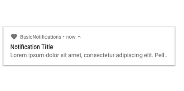

# AndroidCore


## **1. Understand the architecture of Android system**

Apk = Android package. Ce fichier contient toutes l'application.
Android est un systeme linux multiUtilisateur où chaque App a un utilisateur différent.
- Par défaut, le systeme assigne a chaque app un unique Linux user ID. Le systeme donnes les permissions pour tou sles fichiers dans l'application.
- Chaque process a sa propre virtual Machine VM. Le code d'une app tourne en isolation par rapport aux autres process.
- Le systeme gère lui même le lancement et l'arrêt des process.

Il est quand même possible de partager des données entres plusieurs apps:

- Il est possible de s'arranger pour que deux apps aient le même Linux user ID, et dans ce cas elles peuvent accéder aux fichiers de l'une et l'autre. Les apps doivent alors être signées avec le même certificat.
- Une app peut demander les permission pour accéder a certaines données. (camera, bluetooth, location, ...) L'utilisateur autorise explicitement ces autorisations.


***
## **2. Basic building blocks of an android app**

Les App Components sont les composants essentiels de l'application Android. Chaque Component est un point d'entrée pour le systeme ou l'utilisateur. Il y a quatre différents types de components:

- Activities
- Services
- Broadcast receivers
- Content providers

### Activities

L'Activity est le point d'entrée d'interaction avec l'user. C'est en réalité un single screen avec une user interface. Les activities fonctionnent ensemble pour former une user experience cohérente. Les activities que l'on crée pour l'application sera une subclass de la classe `Activity`.

### Services

Un service est un point d'entrée pour une garder une application qui reste en background. Cela permettra de faire des opérations à long terme. Un service n'a pas d'user interface. Par exemple un service peut jouer de la musique dans le background, pendant que l'utilisateur est sur d'autres apps. Ca peut aussi récupérer des données sur le réseau sans bloquer l'interaction avec une Activity. Le service peut être soit un service dont l'utilisateur est conscient (comme un Lecteur de musique), dans ce cas le systeme va essayer de garder des ressources afin que le service ne soit pas terminé prématurément, soit un service en background, et dans ce cas le systeme a beaucoup plus de liberté concernant l'allocation de resources (Le service peut alors être killed si besoin). Un service est une implémentation de la subclass `Service`.

### Broadcast receivers

Un broadcast receivers est par exemple une alarme, par rapport a une application a propos d'un évènement par example. Une fois que l'app a transmis son message au BroadcastReceiver, l'application n'a plus besoin de rester active jusqu'à ce que l'alarme s'éteigne. Les broadcast receivers n'ont pas de User Interface, ils peuvent créer un bar de notification pour alerter l'user quand le broadcast arrive. Il peut aussi prévoir un `JobService` pour faire une tache avec le `Job Scheduler`.
Le broadcast receiver est une subclass de `BroadcastReceiver`. chaque broadcast est un `Intent` object. 

### Content providers

Le content providers est là pour gérer des données qui peuvent être stockéesdans le file systeme, une base SQL, sur le web , ou n'importe quelle autre moyen de stockage.
Pour le systeme, un content provider est un point d'entrée dans une app pour des data items, identifiés par un URI scheme. L'URI est persistante et ne requiert pas que l'App tourne encore.
Un cas d'usage est par exemple l'utilisation de l'apareil photo de l'apareil.


3 de ces composants sont crées avec une `Intent` object. Pour les Activities et services, une intent définie les actions a faire , et peut spécifier les URI sur les datas a processer.
Pour les broadcast receivers, l'intent définie les annonces a être broadcast (example indiquer que la batterie est faible).

// TODO : rechercher des tutos sur les intents pour bien comprendre exactement ce que cést.

Les `intents` sont utilisées pour:
- Lancer une Activity
- Lancer un service (ouvrir email, web browser, faire un appel)
- Passer des datas dans l'application en cours ou dans une autre application.


### Manifest file

Le manifest file définit:

- Identités et user permissions (intenet access, read-access to datas, ...)
- Declares the minimum API Level requis par l'application.
- Declares le hardware et software features utilisées par l'application (camera, bluetooth, screen multitouch)
- Declares les libraries API que l'application a besoin. (comme Google maps)
- Declares les app's components.

```xml
<?xml version="1.0" encoding="utf-8"?>
<manifest ...>
    <application android:icon="@drawable/app_icon.png" ... >
        <activity android:name="com.example.project.ExampleActivity"
            android:label="@string/example_label"...>
        </activity>
            ...
    </application>
</manifest>
```

Il faut declarer dans le manifest, tous les types de components:

`<activity>` elements for activities.
`<service>` elements for services.
`<receiver>` elements for broadcast receivers.
`<provider>` elements for content providers.

Les éléments non-déclarés dans le manifest, ne pourront pas être runnés.
Cela dit pour les broadcast receivers, on peut les register dynamiquement avec l'appel `registerReceiver()`.

On peut aussi declarer dans le manifest les possibilités de l'activité en ajoutant un élément `<intent-filter>`.
Par exemple, si tu fais une application email avec une activité pour composer un nouvel email, on peut déclarer un intent filter pour répondre aux "send" intents (envoi de nouveaux emails):

```xml
<manifest ...>
   ...
    <application ... >
        <activity android:name="com.example.project.ComposeEmailActivity">
            <intent-filter>
                <action android:name="android.intent.action.SEND" />
                <data android:type="*/*" />
                <category android:name="android.intent.category.DEFAULT" />
            </intent-filter>
        </activity>
    </application>
</manifest>
```
// TODO: trouver des tutos sur l'intent-filter


### App requirements

Les requirements d'une app sont faite comme ceci:

```xml
<manifest ... >
    <uses-feature android:name="android.hardware.camera.any"
        android:required="true" />
    <uses-sdk android:minSdkVersion="7" android:targetSdkVersion="19" />
    ...
</manifest>
```

De cette facon, sur GooglePlay un device qui n'a pas le sdk requis ne pourra même pas être installée.


***
## **3. build and run Android app**

### AndroidX Overview

AndroidX compredns les libraries Android Jetpack. AndroidX aide a la backward compatibility avec les précédentes versions d'Android. AndroidX remplace les anciennes librairies Support d'Android (`android.support`). Toutes les nouvelles features seront sous `androidx`.

Pour utiliser les `androidx` libraries dans un projet, il faut compiler au SDK Android 9.0 (API level 28).
Dans le `gradle.properties` si `android.useAndroidX` est mis à `true`, alors Android utilisera la librairie AndroidX par défaut au lieu de la Support Library.

### Android JetPack

JetPack emporte tout un tas de collection d'Android libraries qui incorporent les best practises et sont backward compatible.
Tous les Jetpack components sont dispo sur le Google Maven repositiory.

dans le `build.gradle` file il faut intégrer `google()` comme ci:

```gradle
allprojects {
    repositories {
        google()
        jcenter()
    }
}
``` 

//TODO apprendre ce qu'est précisément Jetpack et comment l'utiliser.
Pour Kotlin, les extensions sont appelées AndroidKTX.


***
## **4. display simple message popup using Toast or Snackbar**

-> Toast.

Le Toast disparait après un certain temps. La place occupée est automatiquement ajustée à la taille du message. Si le message requiert une réponse, utiliser plutot une notification.

```java
Context context = getApplicationContext(); // nécessité du context
CharSequence text = "Hello toast!";
int duration = Toast.LENGTH_SHORT;

Toast toast = Toast.makeText(context, text, duration);
toast.show();
```

on peut changer la position du toast (par exemple ici la position sera a haut a gauche):
```java
toast.setGravity(Gravity.TOP|Gravity.LEFT, 0,0) // deux derniers parametres sont les offsets en x et y
```

On peut aussi créer son propre toast personnalisé, pour cela il va faloir faire un layout personnalisé exemple `layout/custom_toast.xml`, puis appeler ce layout:
```java
LayoutInflater inflater = getLayoutInflater();

View layout = inflater.inflate(R.layout.custom_toast, (ViewGroup) findViewById(R.id.custom_toast_container));
TextView text = (TextView) layout.findViewById(R.id.text);
text.setText("This is a custom toast");

Toast toast = new Toast(getApplicationContext());
toast.setGravity(Gravity.CENTER_VERTICAL, 0 , 0);
toast.setDuration(Toast.LENGTH_LONG);
toast.setView(layout);
toast.show();
```

-> Snackbar

C'est un peu similaire en plus propre, car bandeau en bas.
Cela est implémenté comme cela:
```java
Snackbar snackbar = Snackbar
    .make( (View) findViewById(R.id.myActivity), "Hello from snackbar", Snackbar.LENGTH_LONG) // on peut uniquement utiliser cela
    .setActionTextColor(Color.RED)
    .setAction("RETRY" , new View.OnClickListener(){
        @Override
        public void onClick(View view){

        }
    });
    snackbar.show();
```


***
## **5. display message outside your app's UI using Notification**

Voir tuto : https://codelabs.developers.google.com/codelabs/android-training-notifications/index.html#1

Notifications montrent des informations quand l'application n'est pas en cours. Composée d'une icone, un titre, et un texte concis.



Exemple de création de notification:

```java
NotificationCompat.Builder builder  = new NotificationCompat.Builder(this, CHANNEL_ID)
    .setSmallIcon(R.drawable.notification_icon)
    .setContentTitle("My notification")
    .setContentText("Long text that cannot fit one line ... ")
    .setStyle(new NotificationCompat.BigTextStyle()                 // Facultatif pour faire un style personnalisé
        .bigText("Much longer that cannot fit one line ... "))      //
    .setPriority(NotificationCompat.PRIORITY_DEFAULT);
```

pour pouvoir faire apparaitre la notification (Android 8.0 et plus) , il faut register l'app `notification channel` au systeme en passant une instance de `NotificationChannel`.

**Il faut que le code suivant soit lancé dès que l'application commence.**

```java
private void createNotificationChannel(){
    // create the notificationchannel on API 26+ because the notificationchannel class is not present in the support library
    if (Build.VERSION.SDK_INT >= Build.VERSION_CODES.O){
        CharSequence name = getString(R.string.channel_name);
        String description = getString(R.string.channel_description);
        int importance = NotificationManager.IMPORTANCE_DEFAULT;
        NotificationChannel channel = new NotificationChannel(CHANNEL_ID, nane, importance);
        channel.setDescription(description);
        // Register the channel with the system.
        NotificationManager notificationManager = getSystemService(NotificationManager.class);
        notificationManager.createNotifficationChannel(channel);
    }
}
```

Parceque chaque notification devrait répondre a un tap, en général pour ouvrir l'activité. Pour faire cela:

```java
// Create an explicit intent for an Activity in your app
Intent intent = new Intent(this, AlertDetails.class);
intent.setFlags(Intent.FLAG_ACTIVITY_NEW_TASK | Intent.FLAG_ACTIVITY_CLEAR_TASK);
PendingIntent pendingIntent = PendingIntent.getActivity(this, 0 , intent, 0 );

NotificationCompat.Builder builder = new NotificationCompat.Builder(this, CHANNEL_ID)
    .setSmallIcon(R.drawable.notification_icon)
    .setContentTitle("My notification")
    .setContentText("Hello world")
    .setPriority(NotificationCompat.PRIORITY_DEFAULT)
    // Set the intent that will fire when the use taps the notification
    .setContentIntent(pedningIntent)
    .setAutoCancel(true); // remove the notification quand l'user appuie dessus.
```

Pour montrer la notification, appeler `NotificationManagerCompat.notify()`:

```java
NotificationManagerCompat notificationManager = NotificationManagerCompat.from(this);

// notificationId is a unique int for each notification that you must define
notificationManager.notity(notificationId, builder.build());
``` 

Ajout d'un boutton d'action:


Pour ajouter un bouton d'action, il faut passer une `PendingIntent` a l'action `addAction()` methode. C'est vraiment comme setting l'action par défault de tap, mais cette fois en pouvant faire d'autre choses comme lancer un `BroadcastReceiver` qui performe un job dans le background, de telle sorte que l'action n'interrompe pas l'application.
Par exemple, pour envoyer un broadcast vers un receiver spécifique:

```java
Intent snoozeIntent = new Intent(this, MyBroadcastReceiver.class);
snoozeIntent.setAction(ACTION_SNOOZE);
snoozeIntent.putExtra(EXTRA_NOTIFICATION_ID, 0);
PendingIntent snoozePendingIntent = PendingIntent.getBroadcast(this, 0, snoozeIntent, 0);

NotificationCompat.Builder builder = new NotificationCompat.Builder(this, CHANNEL_ID)
    .setSmallIcon(R.drawable.notification_icon)
    .setContentTitle("My notification")
    .setContentText("Hello world")
    .setPriorty(NotificationCompat.PRIORITY_DEFAULT)
    .setContentIntent(pendingIntent)
    .addAction(R.drawable.ic_snooze, getString(R.string.snooze), snoozePendingIntent);
```

### On peut aussi creer une action directement dans la notification

D'abord il faut créer une instance de `RemoteInput.Builder` qui peut ajouter l'action de notification.

```java
// Key for the string that's delivered in the action's intent
private static final String KEY_TEXT_REPLY = "key_text_reply";

String replyLabel = getResources().getString(R.string.reply_label);
RemoteInput remoteInput = new RemoteInput.Builder(KEY_TEXT_REPLY)
    .setLabel(replyLabel)
    .build();
```

Ensuite, il faut créer une `PendingIntent` pour l'action de réponse:

```java
// Build a pendingIntent for the reply action to trigger.
PendingIntent replyPendingIntent = PendingIntent.getBroadcast(
    getApplicationContext(),
   conversation.getConversationId(),
   getMessageReplyIntent(consation.getConversationId()),
   PendingIntent.FLAG_UPDATE_CURRENT);
```

Puis, attacher le `RemoteInput` object a une action en utilisant `addRemoteInput()`.

```java
// Create the reply action and the remote input
NotificationCompat.Action action = new NotificationCompat.Action.Builder(
    R.drawable.ic_reply_icon, 
    getString(R.string.label),
    replyPendingIntent).addRemoteInput(remoteInput) .build();
```

Enfin appliquer l'action a la notification:

```java
// Build the notification and add the action.
Notification newMessageNotification = new Notification.Builder(context, CHANNEL_ID)
    .setSmallIcon(R.drawable.ic_message)
    .setContentTitle(getString(R.string.title))
    .setContentText(getString(R.string.content))
    .addAction(action)
    .build();

// Issue the notification
NotificationManagerCompat notificationManager = NotificationManagerCompat.from(this);
notificationManager.notify(notificationId, newMessageNotification);
```

### Retrieve user input from the reply

Pour retrouver la réponse de l'utilisateur sur la notification, il faut appeler `RemoteInput.getResultsFromIntent()`:

```java
private CharSequence getMessageText(Intent intent){
    Bundle remoteInput = RemoteInput.getResultsFromIntent(intent);
    if(remoteInput != null){
        return remoteInput.getCharSequence(KEY_TEXT_REPLY);
    }
    return null;
}
```

Après avoir processé le texte, on doit update la notification en appellant `NotificationManagerCompat.notify()` avec le même ID et tag. Cela est nécessaire pour pouvoir faire un feedback à l'user que la réponse fut envoyé correctement et recue:

```java
// Build a new notification, which informs the user that the system handled their interaciont with the previous notification.
Notification repliedNotification = new Notification.Builder(context, CHANNEL_ID)
    .setSmallIcon(R.drawable.ic_message)
    .setContentText(getString(R.string.replied))
    .build();

// Issue the new notification
NotificationManagerCompat notificaitonManager = NotificationManagerCompat.from(this);
notificationManager.notify(notificationId, repliedNotification);
```

Le context va recevoir alors sur le receiver la fonction `onReceive()`.


// TODO: voir ensuite comment faire une ProgressBar
// TODO: voir comment faire une fullScreen notification


***
## **6. understand how to localize an app**

Les best practises recommandent de mettre tous le contenu de l'user Interface danse les resource files. L'endroit pour stocker les strings est dans `res/values/strings.xml`.
Une complexitié peut venir des langues qui s'écrivent de droite à gauche (garder cà en tête). La strucutre des fichiers pour chaque langue doit être de la facon suivante `<resources type>-b+<language code>[+<country code>]`. Cela est valables pour les strings et pour les mipmap files (icones). Example:

Note: Ile est préférable de faire des fichiers par default, et des fichiers localisés. le fichier par défaut est `res/values/strings.xml`.

```files
My Project/
    res/
        values/
            strings.xml
        values-es/        // Espagnol
            strings.xml         
        mipmap/
            country_flag.png
        mimap-es/
            country_flag.png
```
par example dans le fichier `/values/strings.xml`:
```xml
<resources>
    <string name="hello_world">Hello World !</string>
</resources>
```
de même pour l'espagnol:
```xml
<resources>
    <string name="hello_world">Hola Mundo !</string>
</resources>
```

On peut utiliser les resources de maniere programmatique:
```java
// get resources from app's Resources
String hello = getResources().getString(R.string.hello_world);
// or supply a string resource to a method
TextView textView = new TextView(this);
textView.setText(R.string.hello_world);
```
ou bien encore on intègre directement dans le xml `@<resource type>/<resource name>`
```xml
<ImageView
    android:layout_width="wrap_content"
    android:layout_height="wrap_content"
    android:src="@mipmap/country_flag" />
```

*Note*: Pour une bonne UI relire les materials guidelines https://material.io/design/
Ne pas hésiter aussi a commenter les fichiers `strings.xml` pour que les noms soient plus clairs.
Il est possible d'empêcher la traduction dans un fichier xml en utilisant `<xliff:g>`:
```xml
<string name="countdown">
    <xliff:g id="time" example="5 days">%1$s</xliff:g> until today
</string>
<string name="app_homeurl">
    Visit us at <xliff:g id="application_homepage">http://my/app/home.html</xliff:g>
</string>
```

Il est possible d'obtenir la langue de cette facon:
```java
Locale primaryLocale = context.getResources().getConfiguration().getLocales().get(0);
String locale = primaryLocale.getDisplayName();
```


***
## **7. Schedule a background task using JobScheduler**

### JobScheduler

Le `JobScheduler` class permet de lancer des évènements sous certaines conditions ou parametres. Compte tenu des conditions, le JobScheduler calcul le meilleur moment pour l'exécution du Job. Les jobs peuvent être persistants après le reboot. La tâche implémentée est un `JobService`. Le JobScheduler est dispo dpuis l'API 21. Pour backward compatibility, utiliser le `WorkManager`.

Pour utiliser le `JobScheduler`, on a besoin d'un `JobService` et d'un `JobInfo`.

- JobInfo: objet qui contient le set de conditions qui déclenchet le job.
- JobService: implémentation du job qui se lance lorsque les conditions du JobInfo sont remplies.

Très bon tuto:
https://codelabs.developers.google.com/codelabs/android-training-job-scheduler/index.html
Faire aussi coding challenge: https://codelabs.developers.google.com/codelabs/android-training-job-scheduler/index.html#5

### Summary JobScheduler

- `JobScheduler` provides a flexible framework to intellignetly accomplish background services.
- `JobScheduler` is only available on devices running API 21 and higher.
- Tu use the `JobScheduler`, you needs two parts: `JobService` and `JobInfo`.
- `JobInfo` is a set of conditions that trigger the job to run.
- `JobService` implements the job to run under the conditions specified by `JobInfo`.
- You only have to implement the `onStartJob()` and `onStopJob()` callback methods, which you do in your `JobService`.
- The implementation of your job occurs, or is started in `onStartJob()`.
- The `onStartJob()` method retunrs a boolean value that indicates whether the service needs to process the work in a separate thread.
- if `onStartJob()` returns true, you must explicitly call `jobFinished()`. If `onStartJob()` returns false, the runtime calls `jobFinished()` on your behalf.
- `JobService` is processed on the main thread, so you should avoid lengthy calculations or I/O.
- `JobScheduler` is the manager class responsible for scheduling the task. `JobScheduler` batches tasks to maximize the efficiency of system resources, whihc means that you do not have exact control of when tasks are executed.


## WorkManager

Les classes du WorkManager a connaitre sont:
- `Worker` : C'est ici qu'il y aura le code pour le work réel a faire dans le background. Il faut étendre cette classe et override la méthode `doWork()`.
- `WorkRequest` : Cela représente une requête qui doit faire du travail. Il faut passer le Worker lors de la création du `WorkRequest`. Il faut aussi préciser les `Constraints` du worker lorsqu'il sera lancé. 
- `WorkManager` : Cette classe planifie le `WorkRequest` et le fait se lancer. C'est lui qui gèrera l'allocation des resources systeme en honorant les contraintes spécifiées.

excellent tuto: 
https://codelabs.developers.google.com/codelabs/android-workmanager/index.html

Il y a deux types de `WorkRequest`:
- `OneTimeWorkRequest`: Workrequest qui ne va s'exciter qu'une fois.
- `PeriodicWorkRequest`: Une WorkRequest qui va se répéter sur un cycle.


## **8. Android Room with a View**

Nous allons parler d'Architecture Components. Les Architecture components aident a structurer l'app de facon robuste, testable et maintenable, avec moins de code boilerplate.
Diagram d'architecture.


(Entity = annoted class that describes a database table when working with `Room`.)
(DAO = Data access objact. A mapping of SQL queries to functions.)

excellent tuto:
https://codelabs.developers.google.com/codelabs/android-room-with-a-view/#0

tuto a faire, pas évident pour le moment, revenir dessus le temps voulu.


