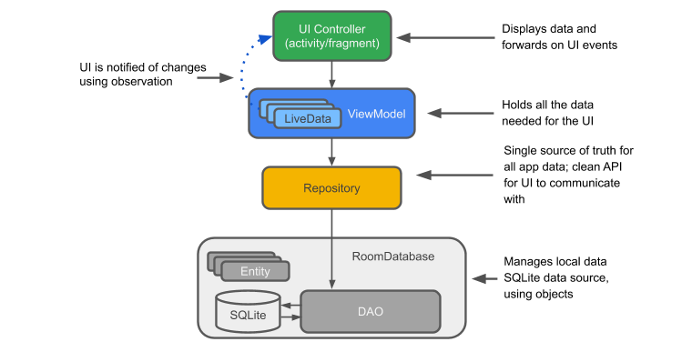
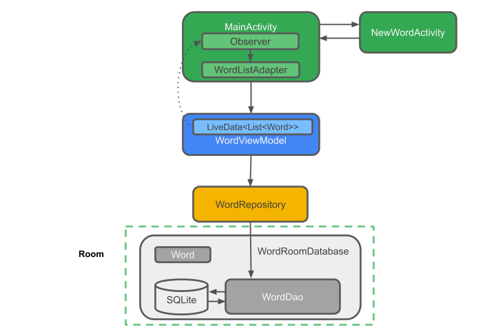
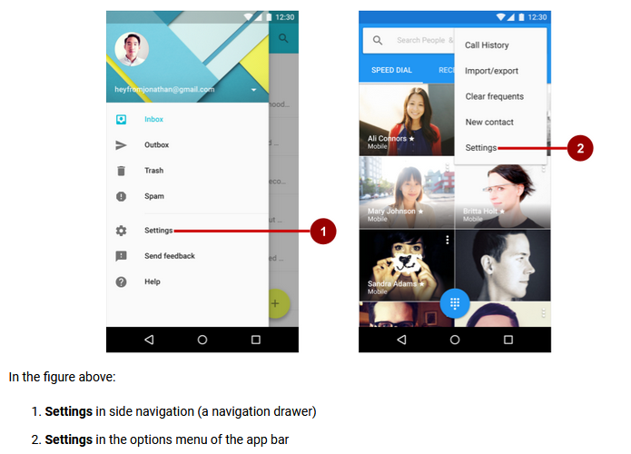

# Android Data Storage

--
## **1.Comporendre comment définir les data en utilisant les Room entities.**

Pour des applications robustes avec une structure plus complexes, il y a une structure recommandée:



Vocabulaire:

- `Entity`: Dans le context des Architecture Components, l'entity est la class qui décrit une database table.
- `SQLite database`: Dans le device, les data sont stoquées sous forme d'une SQLite database. La "Room persistence library" crée et maintient cette database pour nous.
- `DAO`: Data access Object. C'est un mapping de fonctions SQL.
- `Room database`: couche Database qui est au dessus de la SQLite database. La Room database utilise le DAO pour exécuter des queries a la SQLite database.
- `Repository`: Une classe qu'on doit créer pour manager les multiples data sources. In plus de la Room database, le Repository peut gérer des sources de données extérieures type web server.
- `ViewModel`: Fournit les data a l'UI et acte comme un communication center entre le Repository et l'UI. Caches le backend de l'UI. ViewModel instances survivent au changement de configuration des devices.
- `LiveData`: Une class data holder qui suit les "observer pattern" (qui peuvent etre observées). Elles contiennent toujours les caches de la dernière version des données. Elle notifie aussi les observers lorsque les données changent.

Exemple de structure sur une App:



--
## **2.Être capable d'acéder aux base de Données Room en Data Access Object DAO.**

tutoriel:
https://codelabs.developers.google.com/codelabs/android-training-livedata-viewmodel/index.html#1
// TODO : refaire le tuto complétement car beaucoup de choses et se renseigner également sur youtube.

--
## **3.Savoir comment observer et répondre aux modifications de datas en utilisant LiveData**

--
## **4.Comprendre comment utiliser un Repository pour mediate data operations.**

--
## **5.être capable de lier et parser des raw resources ou des assset files.**

--
## **6.Être capable de créer des Préférences persistentes depuis des user data input.**

Les préférences sont utiles si on veut sauvegarder un faible volume de données. Un `SharedPreferences` objet pointe vers un fichier contenant des paires clés/valeures et prévois des méthodes simples pour les lire et écrire.
Pour récupérer les préférences, on peut utiliser 2 méthodes:

- `getSharedPreferences()` : Utiliser ceci si besoin de plusieurs shared preferences files, chacun identifié par un nom, spécifié dans le premier paramètres. Cette méthode est à appeler depuis le Context de l'app.
- `getPreferences()` : Utiliser ceci depuis `Activity` si l'on a besoin d'un seul fichier shared preference file pour l'activity. Du coup, nous n'avons pas besoin de passer un nom en paramètre.

Exemple:
```java
Context context = getActivity();
SharedPreferences sharedPref = context.getSharedPreferences(getString(R.string.preference_file_key), Context.MODE_PRIVATE);
```

Il peut être recommandé de nommer le fichier préférence avec l'applicationID de l'app `"com.example.myapp.PREFERENCE_FILE_KEY"`.

Si on a besoin d'un seul fichier Preferences:
```java
SharedPreferences shasredPref = getActivity().getPreferences(Context.MODE_PRIVATE);
```

***Note:***
Pour sauvegardes les préférences dans le fichier par défaut, utiliser la méthode `getDefaultSharedPreferences()` pour obtenir le fichier.

### Sauvegarder Préférences

Pour sauvegarder, il faut créer un `SharedPreferences.Editor` en appelant `edit()` sur le `SharedPreferences`.

```java
SharedPreferences sharedPref = getActivity().getPreferences(Context.MODE_PRIVATE);
SharedPreferences.Editor editor = sharedPref.edit();
editor.putInt(getString(R.string.saved_high_score_key), newHighScore);
editor.commit(); // écrit dans le fichier de manière asynchrone.
```

### Retrouver valeurs

Il suffit d'appeler les méthodes `getInt()` ou `getSTring()`.

```java
SharedPreferences sharedPref = getActivity().getPreferences(Context.MODE_PRIVATE);
int defaultValue = getResources().getInteger(R.integer.saved_high_score_default_key);
int highScore = sharedPref.getInt(getString(R.string.saved_high_score_key), defaultValue);
```

***Note:*** Pour clear les valeurs il faut faire comme ceci:

```java
SharedPreferences.Editor preferencesEditor = sharedPreferences.edit();
sharedPreferences.clear();
sharedPreferences.apply();
```


--
## **7.Comprendre comment changer le comportement de l'app selon les user preferences.**

Settings:

Une application laisse souvent a l'usager la possibilité de modifier les featureset les comportements. Les utilisateurs s'attendent a pouvoir naviguer sur les app settings dans l'ongle Navigation sur le coté.



Android Studio a un template pour avoir un onglet setting de base. Utiliser lors de la création la `Basic Activity template`.


// TODO : se renseigner sur youtube sur Fragments
// TODO : se renseigner sur PreferenceScreen sur youtube
