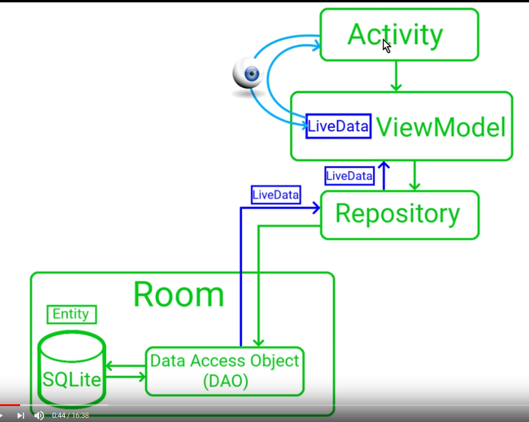

# Architecture:



Dans l'ordre on fera:
- Création de l'objet de base (Note ou User, etc...)
- NoteDao
- NoteDatabase (store les données)
- NoteRpository
- NoteViewModel


## 1.Objet de base
```java
@Entity(tableName = "note_table")
public class Note {

    @PrimaryKey(autoGenerate = true)
    @ColumnInfo(name = "id")
    private int id;
    @ColumnInfo(name = "title")
    private String title;
    @ColumnInfo(name = "description")
    private String description;
    @ColumnInfo(name = "priority")
    private int priority;

    public Note(String title, String description, int priority) {
        this.title = title;
        this.description = description;
        this.priority = priority;
    }

    public String getTitle() {
        return title;
    }
    public String getDescription() {
        return description;
    }
    public int getPriority() {
        return priority;
    }
    public int getId() {
        return id;
    }

    // le Dao en aura besoin pour déterminer un id lors de l'insertion
    public void setId(int id) {
        this.id = id;
    }
}
```

## 2.NoteDao

```java
@Dao
public interface NoteDao {
    @Insert
    void insert(Note note);

    @Update
    void update(Note note);

    @Delete
    void delete(Note note);

    @Query("DELETE FROM note_table")
    void deleteAll();

    @Query("SELECT * FROM note_table ORDER BY priority DESC")
    LiveData<List<Note>> getAllNotes();
}
```

## 3.Database
```java
@Database(entities = {Note.class}, version = 1)
public abstract class NoteDatabase extends RoomDatabase {

    private static NoteDatabase instance;

    public abstract NoteDao noteDao();

    public static synchronized NoteDatabase getInstance(Context context) {
        if (instance == null) {
            instance = Room.databaseBuilder(context.getApplicationContext(), NoteDatabase.class, "note_database")
                    .fallbackToDestructiveMigration()
                    .addCallback(roomCallback)
                    .build();
        }
        return instance;
    }

    private static RoomDatabase.Callback roomCallback = new RoomDatabase.Callback() {
        @Override
        public void onCreate(@NonNull SupportSQLiteDatabase db) {
            super.onCreate(db);
            new PopulateDbAsyncTask(instance).execute();
        }
    };

    private static class PopulateDbAsyncTask extends AsyncTask<Void, Void, Void> {
        private NoteDao noteDao;

        private PopulateDbAsyncTask(NoteDatabase db) {
            noteDao = db.noteDao();
        }

        @Override
        protected Void doInBackground(Void... voids) {
            noteDao.insert(new Note("Title 1", "desc 1 ", 1));
            noteDao.insert(new Note("Title 1", "desc 1 ", 1));
            noteDao.insert(new Note("Title 1", "desc 1 ", 1));
            return null;
        }
    }
}

``` 

## 4.Note Repository
```java
public class NoteRepository {
    private NoteDao noteDao;
    private LiveData<List<Note>> allNotes;

    public NoteRepository(Application application){
        NoteDatabase database = NoteDatabase.getInstance(application);
        noteDao = database.noteDao(); // appelle la methode du RoomDatabases par defaut
        allNotes = noteDao.getAllNotes();
    }

    public void insert(Note note){
        new InsertNoteAsyncTask(noteDao).execute(note);
    }

    public void update(Note note){
        new UpdateNoteAsyncTask(noteDao).execute(note);

    }
    public void  delete(Note note){
        new DeleteNoteAsyncTask(noteDao).execute(note);
    }
    public void deleteAllNotes(){
        new DeleteAllNotesAsyncTask(noteDao).execute();

    }

    public LiveData<List<Note>> getAllNotes(){
       return allNotes;
    }

    private static class InsertNoteAsyncTask extends AsyncTask<Note, Void, Void>{
        private NoteDao noteDao;

        private InsertNoteAsyncTask(NoteDao noteDao){
            this.noteDao = noteDao;
        }

        @Override
        protected Void doInBackground(Note... notes) {
                noteDao.insert(notes[0]);
            return null;
        }
    }
    private static class UpdateNoteAsyncTask extends AsyncTask<Note, Void, Void>{
        private NoteDao noteDao;

        private UpdateNoteAsyncTask(NoteDao noteDao){
            this.noteDao = noteDao;
        }

        @Override
        protected Void doInBackground(Note... notes) {
            noteDao.update(notes[0]);
            return null;
        }
    }
    private static class DeleteNoteAsyncTask extends AsyncTask<Note, Void, Void>{
        private NoteDao noteDao;

        private DeleteNoteAsyncTask(NoteDao noteDao){
            this.noteDao = noteDao;
        }

        @Override
        protected Void doInBackground(Note... notes) {
            noteDao.delete(notes[0]);
            return null;
        }
    }
    private static class DeleteAllNotesAsyncTask extends AsyncTask<Void, Void, Void>{
        private NoteDao noteDao;

        private DeleteAllNotesAsyncTask(NoteDao noteDao){
            this.noteDao = noteDao;
        }

        @Override
        protected Void doInBackground(Void... voids) {
            noteDao.deleteAll();
            return null;
        }
    }
}
```


## 5. NoteViewModel

```java
public class NoteViewModel extends AndroidViewModel {
    private NoteRepository repository;
    private LiveData<List<Note>> allNotes;

    public NoteViewModel(@NonNull Application application) {
        super(application);
        repository=new NoteRepository(application);
        allNotes = repository.getAllNotes();
    }

    public void insert(Note note){
        repository.insert(note);
    }
    public void update(Note note){
        repository.update(note);
    }
    public void delete(Note note){
        repository.delete(note);
    }
    public void deleteAllNotes(){
        repository.deleteAllNotes();
    }

    public LiveData<List<Note>> getAllNotes(){
        return allNotes;
    }
}
```