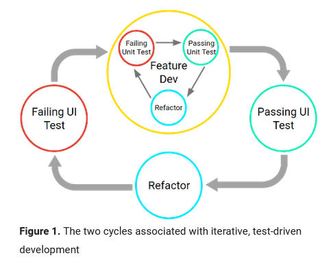
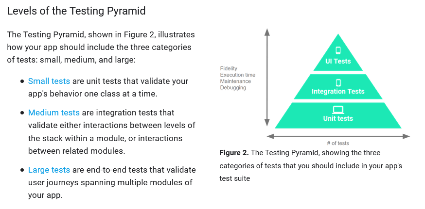

# Android Testing

---
## **1.Comprendre les fondamentaux du testing.**

Lorsque le développement d'une app évolue, on va avoir besoin de faire des fetch de données, accéder a du storage local, utiliser les capteurs du device, ou rendre des interfaces utilisateur complexes. La versatilité de l'app demmande une stratégie de testing compréhensive.

Les bonnes pratiques impliquent avant de faire une nouvelle fonctionnalité d'implémenter le test associé.



Pour l'organisation:
- Le répertoire `androidTest` doit contenir des tests qui sont effectués sur des devices réels ou virtuels.
- Le répertoire `test` doit contenir les tests qui sont executés sur la machine local, comme des Unit tests.

Faire des tests sur des devices réels offrent la meilleure fidélité, mais prennent le plus de temps. A l'inverse, les émulateurs sont les plus rapides pour produire des résultats, mais les résultats ne seront pas aussi fiables.



Sur la pyramide ci-dessus, la proportion généralement utilisée, est de 70% d'Unit tests, 20% d'Integration Test, et enfin 10% UI tests.

--
## **2.Être capable d'écrire des JUnits test locaux.**

Ces tests visent a tester des fonctionnalités internes d'une app.
Ils sont stockés dans le répertoire `test`.
Exemple de test:

```java
@RunWith(JUnit4.class) // indique que le runner effectue le test dans une single class. Pour des tests plus compliqués, il faudra utiliser Espresso
@SmallTest // indique que le test n'a pas de dépendances et doit se faire en millisecondes.
public class CalculatorTest{

    private Calculator mCalculator;

    @Before
    public void setUp() { // set up the environnement before testing.
        mCalculator = new Calculator();
    }

    @Test
    public void addTwoNumbers(){ // test réel.
        double resultAdd = mCalculator.add(1d, 1d);
        assertThat(resultAdd, is(equalTo(2d))); // vérifie le résultat attendu. On ne peut faire des tests que sur des méthodes publiques.
    }

    @Test
    public void divTwoNumbersZero(){
        double resultDiv = mCalculator.div(32d, 0);
        assertThat(resultDiv, is(equalTo(Double.POSITIVE_INFINITY)));
    }
}
```


--
## **3.Comprendre les principes de test UI du framework Espresso.**

--
## **4.Savoir comment écrite des test automatisés pour Android.**

Exemple de création avec le framework Espresso.
Pour activer cela, il faut intégrer le framework dans le build graddle (app):

```
androidTestImplementation 'androidx.test:rules:1.1.0'
androidTestImplementation 'androidx.test:runner:1.1.0'
androidTestImplementation 'androidx.test.espresso:espresso-intents:3.1.0'
```

Pour implémenter concrètement les tests dans l'application, faire:

```java
@RunWith(AndroidJUnit4.class)
@LargeTest
public class ExampleInstrumentedTest{

    private String stringToBeTyped;

    @Rule
    public ActivityTestRule<MainActivity> mActivityRule = new ActivityTestRule<>(MainActivity.class); // création de l'activity

    @Before
    public void initValidString(){
        stringToBeTyped = "Espresso";
    }

    @Test
    public void changeText_sameActivity(){
        onView(withId(R.id.changeText)).perform(click());
        // ou 
        onView(withId(R.id.inputField))
            .perform(typeText(stringToBeTyped));
        onView(withId(R.id.inputField)).check(matches(withText(stringToBeTypes))); // vérification que le champ est bien comme il faudrait.
    }
}
```

#### Methods

vérifier si une activity est affichée:

```java
@Test
public void test_isActivityInView(){
    ActivityScenario<MainActivity> scenario = ActivityScenario.launch(MainActivity.class);
    onView(withId(R.id.main)).check(matches(isDisplayed));

}
```

Ajouter une règle pour plusieurs tests:

```java
@Rule
public ActivityTestRule<SecondActivity> activityRule = new ActivityTestRule(SecondActivity.class);
```

Tester l'affichage d'une nouvelle Activity sur l'appuie d'un boutton

```java
    @Test
    public void test_navSecondaryActivity() {
        ActivityScenario<MainActivity> scenario = ActivityScenario.launch(MainActivity.class);
        onView(withId(R.id.button_next_activity)).perform(click());
        onView(withId(R.id.secondary)).check(matches(isDisplayed()));
        onView(withId(R.id.button_back)).perform(click());
        onView(withId(R.id.main)).check(matches(isDisplayed()));

    }

```