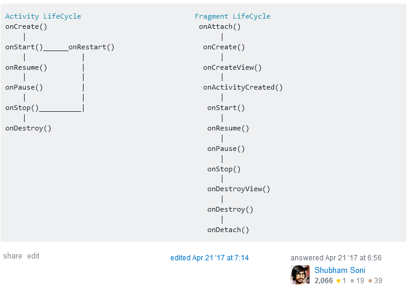

# Android User interface

---
## **1. Understand Android activity lifecycle**

A chaque fois qu'une Activity commence, la preivous activity est stopée, mais le systeme préserves l'activity and la stack ("back stack"). La back stack suit un principe "last in, first out". Quand l'utilisateur a fini avec l'activity actuelle et appuie sur le boutton Back, l'activity est retirée de la stack et est détruite, et l'activity précédente reprends.

Une Activity est commencée ou activée avec une `Intent`. Une `Intent` est un message asynchrone que l'on peut utiliser dans l'activity pour request une action depuis une autre acitivy, ou un autre component de l'app. On utiliser l'intent pour démarrer une activity depuis une autre activity and pour passer des données entre les activities.

Une `Intent` peut être explicite ou implicite:
- Une *explicit intent* est lorsque l'on connait la target de cette intent.
- Une *implicite intent* est lorsque l'on ne connait pas le target component, mais que l'on connait seulement l'action général a réaliser.


---
## **2. Create an Activity that displays a Layout**

Pour lancer une seconde Activity depuis une première Activity:

```java
public void launchSecondActivity(View v){
    Log.d(LOG_TAG, "Button clicked");
    Intent intent = new Intent(this , SecondActivity.class);
    startActivity(intent);
}
```

On va pouvoir se servir de l'Intent pour passer des données a la seconde Activity. On peut passer les données, soit dans le `data field`, ou bien dans les `intent extras`. Les intent data est une URI qui indiquent certaines data spécifiques. Si on a plusieurs données a passer, il vaut mieux se servir des extras.

Les `intent extras` sont des pairs de clés/valeurs dans un `Bundle`. Un `Bundle` est une collection de data. On peut passer des nouvelles paires de valeurs dans ce Bundle.

```java
public void launchSecondActivity(View v){
    Intent intent = new Intent(this, SecondActivity.class);
    EditText mMessageEditText;
    mMessageEditText = findViewById(R.id.editText_main);
    String message = mMessageEditText.getText().toString();
    intent.putExtra("myTag",  message) // we pass here an extra to the intent
    startActivity(intent);
}
```
and in the second activity:

```java
protected void onCreate(Bundle savedInstanceState){
    super.onCreate(savedInstanceState);
    setContentView(R.layout.activity_second);

    Intent intent = getIntent();
    String message = intent.getStringExtra("myTag"); // get from the intent
    TextView textView = findViewById(R.id.text_received);
    textView.setText(message);
}
```

**ATTENTION**
Si on veut lancer une seconde activity en espérant recevoir une réponse de celle ci, il faut faire différemment.
Dans 1ere activity:

```java
public static final int TEXT_REQUEST = 1;

public void launchSecondActivity(Veiw v){
    Intent intent = new Intent(this, SecondActivity.class);
    String message = mMessageEditText.getText().toString();
    intent.putExtra("myTag", message);
    startActivityForResult(intent, TEXT_REQUEST); // instead of startActivity()
}

@Override // this method will be called when it gets the result from the second activity
public void onActivityResult(int requestCode, int resultCode, Intent data){
    super.onActivityResult(requestCode, resultCode, data);
    if(requestCode == TEXT_REQUEST){
        if(resultCode == RESULT_OK){
            String reply = data.getStringExtra(SecondActivity.EXTRA_REPLY);
            mReplyTextView.setText(reply);
        }
    }
}
```
and in second activity:

```java
public static final String EXTRA_REPLY = "com.morganthibert.certiftraining3.extra.REPLY";

public void returnReply(View v){
    String reply = "reply from activity !";
    Intent replyIntent = new Intent();
    replyIntent.putExtra(EXTRA_REPLY, reply);
    setResult(RESULT_OK, replyIntent); // will pass to the onActivityResult method
    finish();
}
```

Si difficultés, revoir le tuto:
https://codelabs.developers.google.com/codelabs/android-training-create-an-activity/index.html#12


### Astuces et night layout

Pour `Override` quelque chose, pour trouver la méthode concernée, faire **Ctrl+O**.
Pour refactoriser des strings dans un XML, faire **Alt+Entrée**.

### Créer un menu

D'abord, il faut créer une nouvelle resource type menu.
dans menu > main_menu.xml:

```xml
<?xml version="1.0" encoding="utf-8">
<menu xmlns:android="http://schemas.android.com/apk/res/android">
    <item 
        andoir:id="@+id/night_mode"
        android:title="@string/night_mode">
</menu>
```

Le menu se create grace a `onCreateOptionsMenu(Menu menu)`:

```java
@Override
public boolean onCreateOptionsMenu(Menu menu){
    getMenuInflater().inflate(R.menu.main_menu, menu); // create menu from the layout
    int nightMode = AppCompatDelegate.getDefaultNightMode();
    if(nightMode == AppCompatDelegate.MODE_NIGHT_YES){
        menu.findItem(R.id.night_mode).setTitle(R.string.day_mode);
    }else{
        menu.findItem(R.id.night_mode).setTitle(R.string.night_mode);
    }
    return true;
}

// fonction trigger lorsquon sélectionne un item d'un menu
@Override boolean onOptionsItemSelected(@NonNull MenuItem item){
    //check which item was clicked
    if(item.getItemId() == R.id.night_mode){
        int nightMode = AppCompatDelegate.getDefaultNightMode();
        if(nightMode == AppCompatDelegate.MODE_NIGHT_YES){
            AppCompatDelegate.setDefaultNightMode(AppCompatDelegate.MODE_NIGHT_NO);
        }else{
            AppCompatDelegate.setDefaultNightMode(AppCompatDelegate.MODE_NIGHT_YES);
        }
        recreate();
    }
    return true;
}
```

### Récupération d'une instance déjà sauvegardée.

Si on ne veut pas que l'application se reset entièrement lorsque l'Activity est détruite (par exemple changement d'orientation, ou screen off), il faut sauvegarder le bundle:

```java
@Override
protected void onSaveInstanceState(Bundle outState){
    // save the score
    outState.putInt("score Team1", mScore1);
    outState.putInt("score Team2", mScore2);
    super.onSaveInstanceState(outState);
}

// et il faut recupérer cette saveInstance lorsque l'Acitivity est crée:
@Override
protected void onCreate(Bundle savedInstanceState){
    super.onCreate(savedInstanceState);
    setContentView(R.layout.activity_main);
    ...
    if(savedInstanceState != null){
        mScore1 = savedInstanceState.getInt("score Team 1");
        mScore2 = savedInstanceState.getInt("score Team 2");
        ...
    }
}
```


---
## **3. Construct an UI witch ConstraintLayout**

Un élément dans un ConstraintLayout a besoin d'au moins une contrainte Verticale et une contrainte Horizontale.


Pour faire des offsets horizontal, utiliser l'interface qui marche assez bien:


Pour l'alignement ne pas hésiter a utiliser l'outil `Alignement` dans la barre d'outils de l'interface !
De même pour le `Baseline alginement` ou le `Baseline constraint`.

Possibilité aussi d'utiliser les `guidelines` qui sont des sortes de lignes de construction. Cela semble très très utile.


Il existe aussi l'outil 'Barrier' qui est très similaire à une guideline, mais cette fois la barrière est placable selon un élément, et non à une distance fixe.


Il est aussi utile d'utiliser l'outil `margin` par défaut pour faciliter le placement.
Les guidelines Material design recommandent plutot des margins par défaut de 8dp.


Il y a différentes facons d'avoir plusieurs éléments sur une ligne horizontale.
Voici différentes facons:

- Spread = views distribuées de manière égale.
- Spread inside = premier et dernier sont fixés, ceux du milieu sont distribués de manière égale.
- Weighted = Les éléments sont distribués de manière égales, mais sans espace entre chaque élément.
- Packed = Éléments regroupés au milieu.

Pour faire une chaine facilement, sélectionnez les éléments et faites un click droit et `Créer une chaine`.


### Animations

L'avantage d'un ConstraintLayout est de pouvoir faire plus facilement des animations.

Pour faire cela, faire deux layouts. Un avec le styling et les positions de départ, et un autre avec les positions de fin.


**Attention: les ContraintSet animations animent seulement la taille et la position des éléments enfants. Ils n'animent pas les autres attributs (comme la couleur par exemple).

```java
ConstraintSet mConstraintSet1 = new ConstraintSet();
ConstraintSet mConstraintSet2 = new ConstraintSet();
ConstraintLayout mConstraintLayout; // cache the ConstraintLayout
boolean mOld= true;

protected void onCreate(Bundle savedInstanceState){
    super.onCreate(savedInstanceState);
    Context context = this;
    mConstraintSet2.clone(context, R.layout.state2); // get constraint from layout
    setContentView(R.layout.state1);
    mConstraintLayout = (ConstraintLayout) findViewById(R.id.activity_main);
    mConstraintSet1.clone(mConstraintLayout); // get constraints from ConstraintSet
}

public void foo(View view){
    TransitionManager.beginDelayedTransition(mConstraintLayout);
    if(mOld = ! mOld){
        mConstraintSet1.applyTo(mContraintLayout); // set new constraint
    } else{
        mConstraintSet2.applyTo(mConstraintLayout); // set new constraints
    }
}
```

// TODO: pour l'animation se renseigner davantage.


--
## **4. Create a custom View class and add it to a Layout**

**Introduction au ViewModel**

Puisque dans Android, l'activity est relancée très régulièrement (et recrée), par exemple lors d'un passage au format paysage, il faut éviter de stocker des données dans l'Activity. A la place, il est préférable d'utiliser un `ViewModel` qui lui aura la charge de stocker les données. De manière générale il est mieux de garder une responsabilité par élément. Les activity ne devraient pas stocker de données, ce n'est pas vraiment leur role, elles sont la juste pour les règles de rendu.


**Il ne faut jamais passer le Context dans le ViewFolder**

Pour faire un viewModel:

```java
public class MyViewModel extends ViewModel {
    private int myVar = 1;

    public int getMyVar(){
        return myVar;
    }
}
```
et dans MainActivity

```java
protected void onCreate(Bundle savedInstanceState){
    super.onCreate(savedInstanceState);
    setContentView(R.layout.activity_main);

    MyViewModel model = new ViewModelProvider(this).get(MyViewMode.class);
    int result = model.getMyVar();

    TextView tv = findViewById(R.id.textView);
    tv.setText(Integer.toString(result));
}
```


## **5. Implémentation d'un theme custom**

## **6. Accessibility hooks vers une custom View**


## **7. Content descriptions aux Views pour accessibilité**

---
## **8. Items dans une RecyclerView**

Si l'application a besoin d'afficher une liste d'éléments basée sur des données assez conséquentes, ou des données qui changent fréquemment. (Pour partir d'une template sur Android studio, faire File > New > Fragment > Fragment(list)).

(Si besoin d'afficher sous forme de Cards, utiliser la `CardView`).

Un `RecyclerView` est en réalité une version plus avancée d'une `ListView`.
Le `RecyclerView` se remplit lui même par des views founries par le layout manager.
Utilisation:

```java
private RecyclerView recyclerView;
private RecyclerView.Adapter mAdapter;
private RecyclerView.LayoutManager layoutManager;

@Override
protected void onCreate(Bundle savedInstanceState){
    super.onCreate(savedInstanceState);
    setContentView(R.layout.my_activity);
    recyclerView = (RecyclerView) findViewById(R.id.my_recycler_view);

    // use this setting to improve performance if you know taht changes in content do not change the layout size of the RecyclerView
    recyclerView.setHasFixedSize(true);

    // use a linear layout manager
    layoutManager = new LinearLayoutManager(this);
    recyclerView.setLayoutManager(layoutManager);

    //specify and adapter
    mAdapter = new MyAdapter(myDataset);
    recyclerView.setAdapter(mAdapter);
}
```

Exemple de View MyAdapter.

```java
public class MyAdapter extends RecyclerView.Adapter<MyAdapter.MyViewHoder>{
    private String[] mDataset;

    // Provide a reference to the views for each data item. Complex data items may need more than one view per item.
    public static class MyViewHolder extends RecyclerView.ViewHolder {
        // each data item is just a sting in this case
        public TextView textView;
        public MyViewHolder(TextView v){
            super(v);
            textView = v;
        }
    }

    // Provide a suitable constructor (depends on the kind of dataset)
    public MyAdapter(String[] myDataset){
        mDataset = myDataset;
    }

    // Create new views (invoked by the layout manager)
    @Override
    public MyAdapter.MyViewHolder onCreateViewHolder(ViewGroup parent, int viewType){
        // create a new view
        TextView v  = (TextView) LayoutInflater.from(parent.getContext()).inflate(R.layout.my_text_view, parent, false);
        ...
        MyViewHolder vh = new MyViewHolder(v);
        return vh;
    }

    // Replace the contents of a view (invoked by the layout manager)
    @Override
    public void onBindViewHolder(MyViewHolder holder, int position){
        // - get element from your dataset at this position
        // - replace the contents of the view with that elemtn
        holder.textView.setText(mDataset[position]);
    }

    //Return the size of your dataset (invoked by the layout manager)
    @Override
    public int getItemCount() {
        return mDataset.length;
    }
}
```


## **9. Bind local data to a RecyclerView list using Paging Library**

## **10. Menu-based navigation**

--
## **11. Implémentation de Drawer Navigation**

Pour créer un drawer layout:


Il faut creer un menu (faire add 'Android resource directory' et choisir 'menu'). Créer un nouveau `menu_item.xml`.

```xml
<?xml version...>
<menu ...>
    <item
    android:id="@+id/profile"
    android:title="Profile"/>
    <item
    android:id="@+id/contact"
    android:title="Contact"/>
    <item
    android:id="@+id/about"
    android:title="About"/>
...
</menu>
```

Dans MainActivity:
```java
public class MainActivity extends AppCompatActivity implements NavigationView.OnNavigationItemSelectedListener {

    DrawerLayout drawerLayout;
    Toolbar toolbar;
    NavigationView navigationView;
    ActionBarDrawerToggle toggle;

    @Override
    protected void onCreate(Bundle savedInstanceState){
        super.onCreate(savedInstanceState);
        setContentView(R.layout.activity_main);

        drawerLayout = findViewById(R.id.drawer);
        toolbar = findViewById(R.id.toolbar);
        navigationView = findViewById(R.id.navigation_view);

        setSupportActionBar(toolbar); // integre actionBar
        ActionBar myBar = getSupportActionBar();
        myBar.setSubtitle("Test");
        myBar.setDisplayShowTitleEnabled(true);

        // create the detection of the item selected
        toggle = new ActionBarDrawerToggle(this, drawerLayout, toolbar, R.string.drawerOpen, R.sting.drawerClosed);
        drawerLayout.addDraweListener(toggle);
        toggle.syncState();
        navigationView.setNavigationItemSelectedListener(this);

    }

    @Override
    public boolean onNavigationItemSelected(@NonNull MenuItem menuItem){
        switch(menuItem.getItemId()){
            case R.id.profile:
                Toast.makeText(this, "Profile selected", Toast.LENGTH_LONG).show();
                break;
            case R.id.contact:
                Toast.makeText(this, "Contact selected", Toast.LENGTH_LONG).show();
                break;
            ...
        }
        return false;
    }
}
```


--
## **12.Activity and Fragments.**

Un fragment est en quelque sorte comme une petite Activity, avec quelques propriétés différentes.



Les fragements peuvent facilement être récupérés et intégrés dans différentes activities.

Création d'un fragment simple type Login:
(voir tuto excellent: https://www.youtube.com/watch?v=8MCvEtjTxvs)

Pour créer un fragment faire File > New > Fragment (Blank)
Un fichier de layout va être crée ainsi qu'un fichier BlankFragment.java.

Mettre alors ce que l'on veut dans le layout (remplacer le layout de base par un ConstraintLayout)
Et pour le fichier java, il y a deux facons d'implémenter, soit on va mettre les méthods dans le fragement, ou bien avec le code généré automatiquement, les méthodes devront etre définies dams l'Activity parente.

```java
// Après avoir effacé le code template

public class BlankFragment extends Fragment{
    
    private EditText txtLogin;
    private EditText txtPassword;
    private Button btnConnect;

    public void onCreateView(@NonNull LayoutInflater inflater, @Nullable ViewGroup container, @Nullable Bundle savedInstanceState){ // création du fragment
        View rootView = inflater.inflate(R.layout.fragment_blank, conatiner, true);

        txtLogin = (EditText) rootView.findViewById(R.id.txtLogin);
        txtPassword = (EditText) rootView.findViewById(R.id.txtPassword);
        btnConnect = (Button) rootView.findViewById(R.id.btnConnect);

        btnConnect.setOnClickListener(btnConnectListener); // attache le listener
        return rootView;
    }

    // implementation du listener
    private View.OnClickListener btnConnectListener = new View.OnClickListener() {
        @Override
        public void onCLick(View v){
            Log.i("Debug", txtLogin.getText() + " / " + txtPassword.getText());
        }
    };
}
```

Pour intégrer le Fragment, le glisser dans l'acitivy_main.xml. 


Pour pouvoir voir le fragment directement dans l'apercu, cliquer sur la mention "Unknow fragments" et sélectionner le "Pick Layout" pour indiquer quel layout correspond au Fragment qui doit etre rendu.

Revoir la fin du tuto pour voir comment faire avec le code template fournit de base par un fragment.

--

## **13. Creation d'une alert box.**

L'alert box et un moyen facile et rapide de demander Oui/Non à l'utilisateur:


Et pour l'implémentation JAVA:

```java
public void congratulations(){
    AlertDialog myAlert = new AlertDialog.Builder(this).create();
    myAlert.setTitle("my Alert Dialog Window");
    myAlert.setMessage("Hello world");

    // methode a répéter pour chaque bouton. (BUTTON_POSITIVE, BUTTON_NEGATIVE, BUTTON_NEUTRAL)
    myAlert.setButton(AlertDialog.BUTTON_POSITIVE, "OUI", new AlertDialog.OnClickListener(){
        @Override
        public void onClick(DialogInterface dialog, int which){
            Log.e("DEBUG", "alert dialog clicked");
        }
    });
    myAlert.show();
}
```
