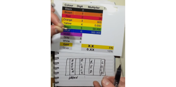
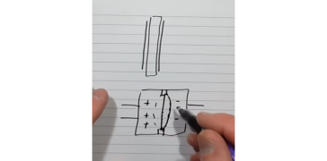
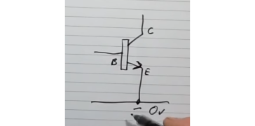
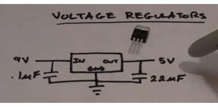
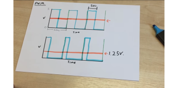
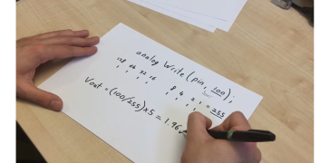

# arduino certification

Topics:

-> Electricity
-> Electronic Components
-> Reading Circuits and schematics
-> Frequency and duty cycle
-> Programming Logic
-> Programming Syntax
-> Arduino IDE
-> Arduino Boards


## Topics hors sujets et questions precises:

Q: What is an actuator:
R: C'est un device qui fait bouger quelque chose, ou active quelque chose. (Dans la question de l'essai il faut repondre le piezo)


## Sujets


### 1.Electricity

**Resistances**

Color code



La bande Or ou argent indique la tolérance.

**Capacitor**



Un capacitor est deux feuilles de metal séparées par un isolant.
Capacité mesurée en Farrads.


**Diodes**

Il existe les diodes avec la lumière, ou sans la lumière. Ne laisse passer le courant que dans une direction.

Diodes Zener sont des diodes utilisés comme voltage regulation.


**Transistors**

Exemple npn transisitor:



on va controller la Base, ce qui va ouvrir ou non le passage du courant avec un multiplier entre l'Emitteur et le Récepteur.
On peut aussi parler de MOSFET lorsque les loads sont beaucoup plus importantes.


### 2.Electronic Components

**Voltage regulators**
Permet de garder un courant de la valeur que nous souhaitons.



Utilie pour les moteurs par exemple.
Les capaciteurs permettents de garder un voltage correct pour un moteur par exemple.


3.
4.

### 5.Programming logic

Binary logic, Most Signifiant Bit and Less Signifiant Bit


6.

### 7.Arduino IDE

Exemple basique de code:

```java

int led = 13;
int button = 1;

void setup(){
    pinMode(led, OUTPUT); // comment
    pinMode(button, INPUT);

}

void loop(){

    digitalRead(button);

    digitalWrite(led, HIGH);
    delay(1000);
    digitalWrite(led, LOW);
    delay(1000);

    
}
```

Lorsqu'on veut faire un digitalRead, il faut connecter la pin de cette facon:

De cette facon, si le circuit n'est pas branché, le courant prends l'embranchement avec le moins de resistance. et donc la pin est reliée au GND (donc 0V). Et si on ferme le contact, la pin est reliée directement au 5V.

**Serial Printing**

Serial printing utilises le protocole RS232.

```java
Serial.begin(9600); // BAUD rate = number of bytes send by second
Serial.println("Hello world");
if(digitalRead(button) == HIGH){
    Serial.println("Button is pressed"); // print on a new line
    Serial.println(buttonValue); // permet d'imprimer un int.
}
```

L'éditeur doit avoir le même BAUD rate que le SerialBegin.

**PWM** (Pulse width modulation)
Permet de faire de l'analogique avec des pins digitales.
Permet de controller le volume d'un speaker ou vitesse d'un moteur.

Fonctionnement (schema):
Le signal de sortie est équivalent par rapport au temps passé au niveau haut. De cette facon, en alternant niveau haut et niveau bas sur des intervalles de 20ms, on peut obtenir un signal "quasi" analogique.



Il est possible de faire 255 niveaux analogiques, car information codée sur 8bits.
Le signal de sortie restera bien sur entre 0 et 5v:
(Si on ecrit `analogWrite(pin, 100))`, alors Vsortie = 1.96V




Par exemple, dans le code suivant pour faire une led qui s'allume de moins en moins fort:
```java
int led = 6;

void setup(){
    pinMOde(led, OUTPUT);
}

void loop(){
    analogWrite(led, 255); // il faut donner une valeure entre 0 et 255
    delay(500);
    analogWrite(led, 200);
    delay(500);
    analogWrite(led, 150);
    delay(500);
    analogWrite(led,100);
    delay(500);
}
```

**AnalogRead**

AnalogRead is just measuring a voltage between 0 and 5 volts and truning it into a value between 0 and 1023.
(1023, parceque signal codé sur 10 bits).

Si on mesure 3v, alors l'analogRead va renvoyer comme mesure:
(Voltage in / Max voltage) * 1023
    => (3/5) * 1023 = 614

```java
int IR=A0;

void setup(){
    pinMode(IR, INPUT);
    Serial.begin(9600);
}
void loop(){
    Serial.println(analogRead(IR)); // value between 0 and 1023
    delay(50);
}
```

**Utilisation Serial Plotter**

Très utile pour voir les courbes de valeurs des entrees analogiques
On peut faire apparaitre plusieurs valeurs si on met un limiteur comme ",".
Exemple:

```java
Serial.print(valA);
Serial.print(",");
Serial.println(valB);
```


### 8.Arduino Boards

Les differences sont dans la capacité mémoire et certaines fonctions. (Entrées sorties et possibilités).

    - Leonardo
    - Uno
    - Mega

    Coeur = ATMEGA328P

    Il y a 3 petites leds integrees L, TX, RX. La led L peut servir directement pour tester le fonctionnement sans avoir besoin de brancher une LED.

    Arduino UNO a en realité 2 controlleurs internes.
    A chaque fois qu'on reset un arduino, le bootloader load 1 premier code, et le 2eme code est execute ensuite.

    USB => |  FTDI chip  | => conversion vers le ATMEGA de facon a ce que le ATMEGA comprennes les instructions
    Le bootloader va faire le lien avec le code stocké, de facon a ce qu'il soit reecrit a chaque fois que l'arduino est reseté.

    Le bootloader doit pouvoir gérer plusieurs protocoles de communication (USB, bluetooth, NFC, ethernet , etc). Et du coup le bootloader devient plus gros, et engendre des risques de bugs.


    Le bootloader, fait un call qui dit : "Copie le code depuis tel source (pour arduino SRAM) dans le program de l'ATMEGA". De cette facon, le code du bootloader est tres simple et donc tres peu de bugs. Il dit juste oú trouver le code et éventuellement quelle taille fait le code.

    Pour résumer:

    USB => stocke dans SRAM
    
    bootloader dit a chaque demarrage: va copier dans le program le code situé dans la SRAM.


=> DigitalPins
    Si activé, il sort 5V, sinon 0V.
    Les pins Digital peuvent seulement fournir ou recevoir 20mA ! (sinon risque de dommages)
    Si on a besoin de faire plus de puissance, il faut utiliser un transistor qui declenchera ou non la coupure du circuit relié à une Alim.
    declenché grace à digitalWrite().
    On peut lire grace a digitalRead().

=> AnalgoPins
    AnalogIn permets de lire des informations analogiques.