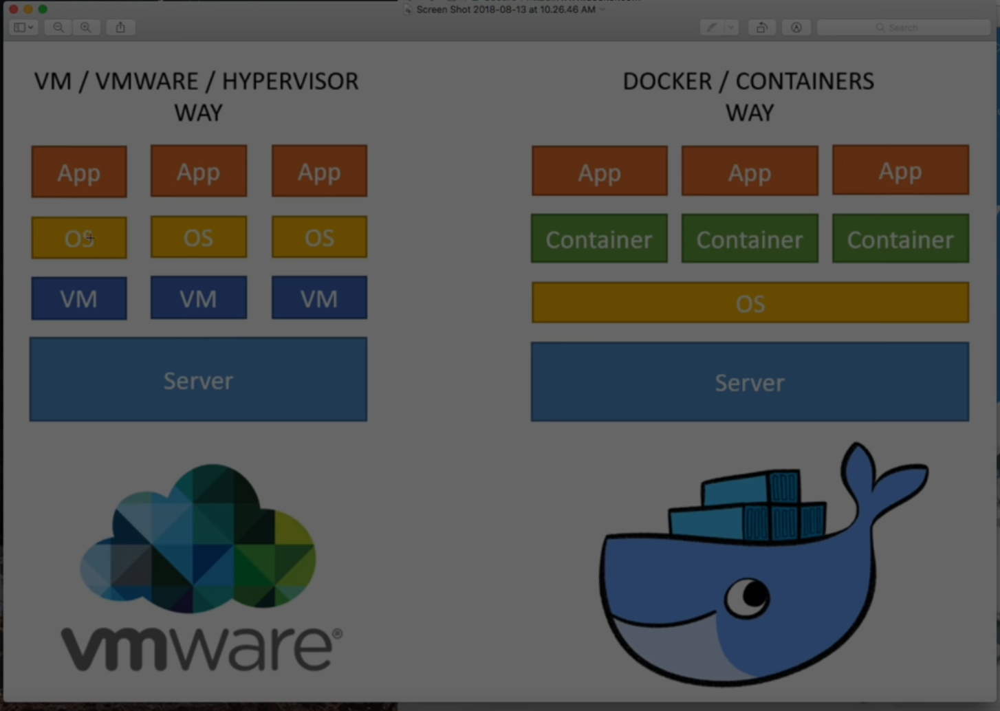

# Docker Essentials

Docker permet de lancer des environnements sous forme de container.

Ecrire quelque chose dans un container 
=> Le code sera lance de le meme facon selon le systeme d'exploitation
(un peu comme une machine virtuelle mais en plus puissant).

Docker se lance depuis le terminal en tapant docker

ou bien si soucis lancer le docker quick start depuis demarrer

    docker version
    docker info

## Utilisation

    docker container run -it -p 80:80 nginx
      // it = interactive mode
      // -p = publish
      // 80:80  le premier est toujours 80, le deuxieme est lie au container ici Apache c'est 80, mais sql est different par exemple
      // ngix nom de l'image

Pas pu poursuivre le tuto une erreur me bloque..

      docker container ls
